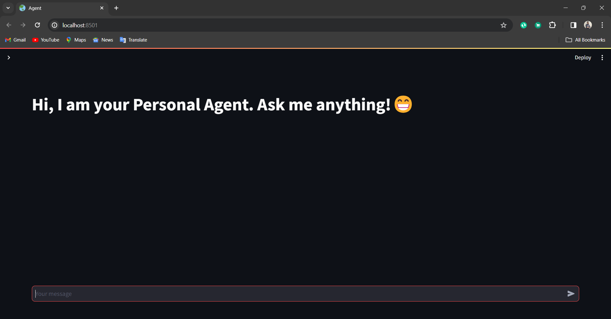
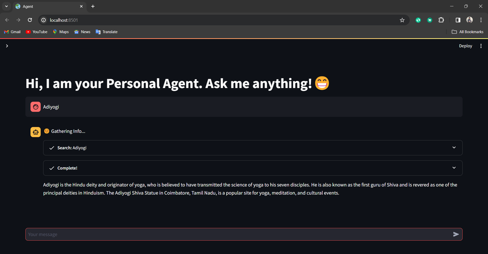
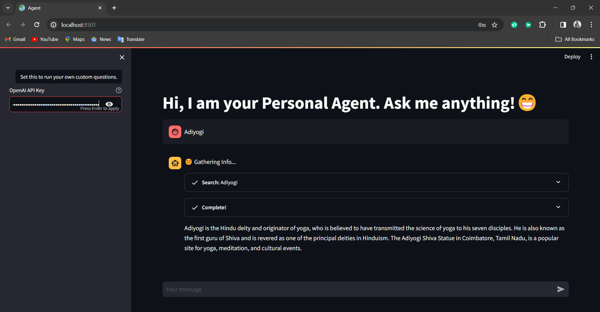
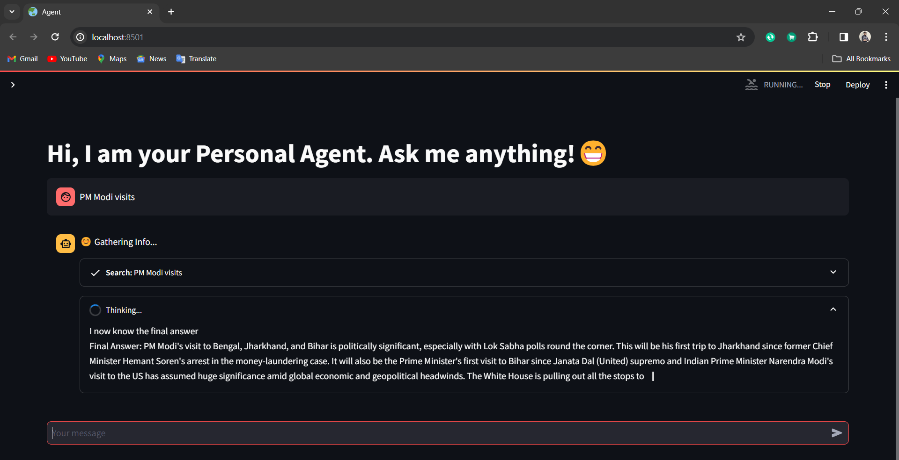
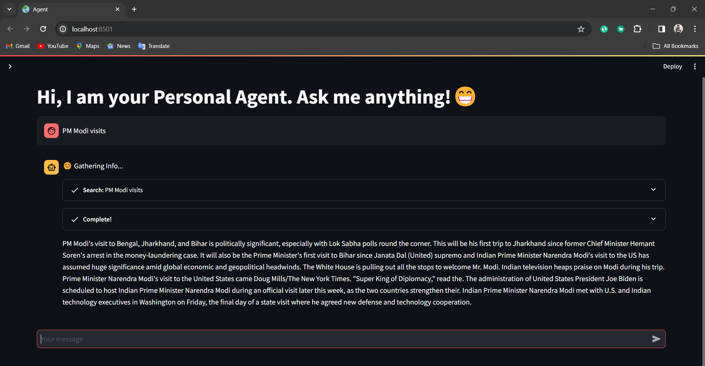

# AI Personal Agent

Welcome to the AI Personal Agent project, where cutting-edge language models (LLMs) converge to create an intuitive and responsive assistant. Harnessing the power of Streamlit, this project integrates diverse language models and tools to provide an interactive experience for users seeking assistance and answers. 🤖💬


<p align="center">
  
  
  
  
  
</p>

## 🌟 Features

- **Interactive Interface**: Seamlessly interact with the personal agent through a user-friendly Streamlit interface.
- **Robust Language Models**: Leverage state-of-the-art language models including OpenAI's GPT, DuckDuckGo search, and mathematical reasoning capabilities.
- **Customizable Queries**: Empower users to ask tailored questions through OpenAI's API key integration, ensuring personalized responses.
- **Real-time Responses**: Receive instantaneous responses to your queries, providing timely assistance whenever you need it. 🚀⏱️

## 📸 Image Gallery

### Main Interface



Dive into the immersive main interface of the personal agent application, offering a visually engaging experience. 🌟

### Custom Questions









These screenshots showcase the versatility of the personal agent, allowing users to pose custom questions through OpenAI's API key integration. 🎨📸

## Setup

1. **Clone the Repository**: Get started by cloning the repository to your local machine:

   ```bash
   git clone https://github.com/pramodkoujalagi/AI-Personal-Agent.git


2. Install the required dependencies:
   
   ```bash
   pip install -r requirements.txt
   ```

3. Set up environment variables by creating a `.env` file and adding your OpenAI API key:

    ```bash
    OPENAI_API_KEY=your_openai_api_key
    ```


## Usage

1. **Run the Streamlit application:**
   ```bash
   streamlit run agent.py
   ```


2. **Access the Application:** Open your preferred web browser and access the application to start interacting with the personal agent.


3. **Engage with the Personal Agent:** Enter your queries in the chat interface and experience the responsiveness of the personal agent firsthand. 💡👨‍💻

## Configuration

- **Customize Behavior:** Tailor the behavior of the personal agent by modifying the code in agent.py.
- **Adjust Parameters:** Fine-tune temperature settings and other parameters in the language model initialization to enhance the quality of responses.

## Contributor

[Pramod Koujalagi](https://github.com/pramodkoujalagi)

Feel free to explore, engage, and contribute to this exciting project! 🌟🚀

## ⚖️ License
[MIT License](LICENSE)


