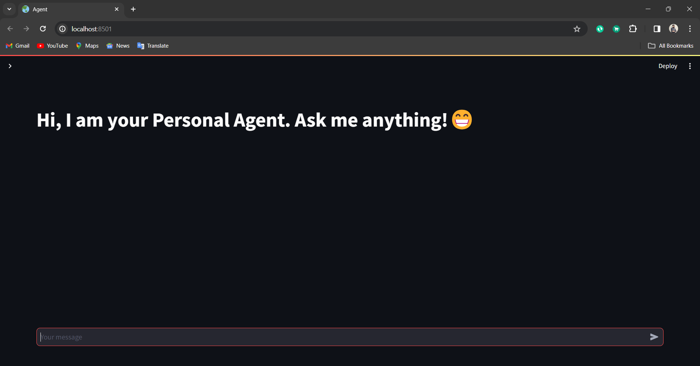
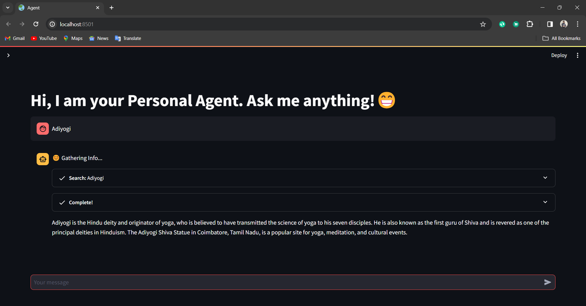
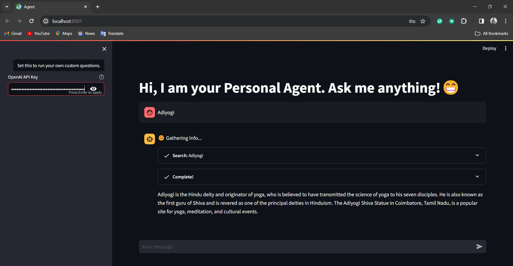
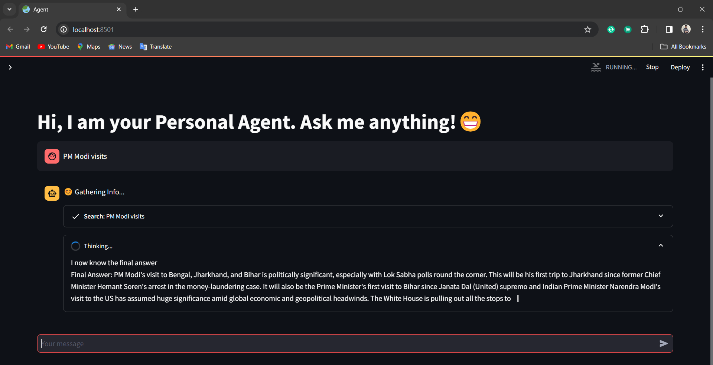
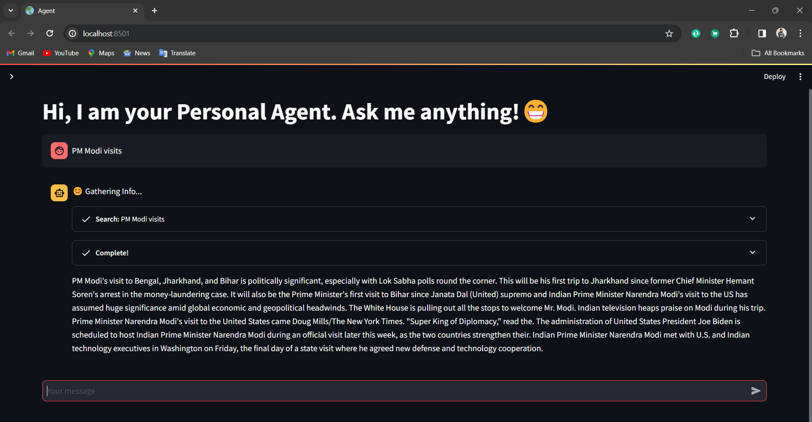

# AI Personal Agent

This project implements a personal agent using Streamlit, integrating various large language models(LLM) and tools for answering user queries and providing assistance.

## Features

- Enables users to interact with a personal agent through a Streamlit interface.
- Utilizes language models and tools such as OpenAI's GPT, DuckDuckGo search, and mathematical reasoning capabilities.
- Supports custom questions through OpenAI's API key integration.
- Provides responses to user queries in real-time.


## Screenshots

### Main Interface



This screenshot shows the main interface of the personal agent application.

### Custom Question








These screenshots demonstrates the feature allowing users to ask custom questions through OpenAI's API key integration.

## Setup

1. Clone the repository to your local machine:
   
   ```bash
   git clone https://github.com/pramodkoujalagi/AI-Personal-Agent.git
   ```

2. Install the required dependencies:
   
   ```bash
   pip install -r requirements.txt
   ```

3. Set up environment variables by creating a `.env` file and adding your OpenAI API key:

    ```bash
    OPENAI_API_KEY=your_openai_api_key
    ```


## Usage

1. Run the Streamlit application:
   ```bash
   streamlit run agent.py
   ```


2. Access the application in your web browser.

3. Enter your queries in the chat interface and interact with the personal agent.

## Configuration

- Customize the behavior of the personal agent by modifying the code in `agent.py`.
- Adjust temperature settings and other parameters in the language model initialization for tailored responses.

## Contributor

[Pramod Koujalagi](https://github.com/pramodkoujalagi)


